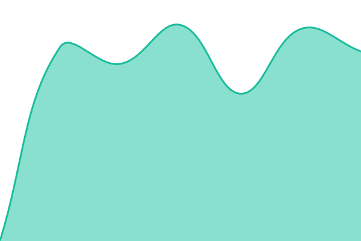

# [📈 Live Status](https://status.qado.ai): <!--live status--> **🟩 All systems operational**

This repository contains the open-source uptime monitor and status page for [qado-ai](https://status.qado.ai), powered by [Upptime](https://github.com/upptime/upptime).

With [Upptime](https://upptime.js.org), you can get your own unlimited and free uptime monitor and status page, powered entirely by a GitHub repository. We use [Issues](https://github.com/qado-ai/status.qado.ai/issues) as incident reports, [Actions](https://github.com/qado-ai/status.qado.ai/actions) as uptime monitors, and [Pages](https://status.qado.ai) for the status page.

<!--start: status pages-->
<!-- This summary is generated by Upptime (https://github.com/upptime/upptime) -->
<!-- Do not edit this manually, your changes will be overwritten -->
<!-- prettier-ignore -->
| URL | Status | History | Response Time | Uptime |
| --- | ------ | ------- | ------------- | ------ |
|  [Web Application](https://core.qado.ai/api-v2/health) | 🟩 Up | [web-application.yml](https://github.com/qado-ai/status.qado.ai/commits/HEAD/history/web-application.yml) | 

 678ms
     
 | 

<a href="https://status.qado.ai/history/web-application">100.00%</a>
    

|  [Platform (All Systems)](https://core.qado.ai/api-v2/healthz) | 🟩 Up | [platform-all-systems.yml](https://github.com/qado-ai/status.qado.ai/commits/HEAD/history/platform-all-systems.yml) | 

 3059ms
     
 | 

<a href="https://status.qado.ai/history/platform-all-systems">0.00%</a>
    

|  [Authentication & Login](https://core.qado.ai/api-v2/healthz?component=authentication) | 🟩 Up | [authentication-and-login.yml](https://github.com/qado-ai/status.qado.ai/commits/HEAD/history/authentication-and-login.yml) | 

 952ms
     
 | 

<a href="https://status.qado.ai/history/authentication-and-login">0.00%</a>
    

|  [Core Database](https://core.qado.ai/api-v2/healthz?component=core-database) | 🟩 Up | [core-database.yml](https://github.com/qado-ai/status.qado.ai/commits/HEAD/history/core-database.yml) | 

 644ms
     
 | 

<a href="https://status.qado.ai/history/core-database">0.00%</a>
    

|  [Knowledge Graph](https://core.qado.ai/api-v2/healthz?component=knowledge-graph) | 🟩 Up | [knowledge-graph.yml](https://github.com/qado-ai/status.qado.ai/commits/HEAD/history/knowledge-graph.yml) | 

 625ms
     
 | 

<a href="https://status.qado.ai/history/knowledge-graph">0.00%</a>
    

|  [Document Storage](https://core.qado.ai/api-v2/healthz?component=document-storage) | 🟩 Up | [document-storage.yml](https://github.com/qado-ai/status.qado.ai/commits/HEAD/history/document-storage.yml) | 

 173ms
     
 | 

<a href="https://status.qado.ai/history/document-storage">0.00%</a>
    

|  [Document Analysis](https://core.qado.ai/api-v2/healthz?component=document-analysis) | 🟩 Up | [document-analysis.yml](https://github.com/qado-ai/status.qado.ai/commits/HEAD/history/document-analysis.yml) | 

 814ms
     
 | 

<a href="https://status.qado.ai/history/document-analysis">0.00%</a>
    

|  [AI Processing](https://core.qado.ai/api-v2/healthz?component=ai-processing) | 🟩 Up | [ai-processing.yml](https://github.com/qado-ai/status.qado.ai/commits/HEAD/history/ai-processing.yml) | 

 503ms
     
 | 

<a href="https://status.qado.ai/history/ai-processing">0.00%</a>
    

|  [Background Processing](https://core.qado.ai/api-v2/healthz?component=background-processing) | 🟩 Up | [background-processing.yml](https://github.com/qado-ai/status.qado.ai/commits/HEAD/history/background-processing.yml) | 

 640ms
     
 | 

<a href="https://status.qado.ai/history/background-processing">0.00%</a>
    

<!--end: status pages-->

[**Visit our status website →**](https://status.qado.ai)

## 📄 License

- Powered by: [Upptime](https://github.com/upptime/upptime)
- Code: [MIT](./LICENSE) © [Anand Chowdhary](https://anandchowdhary.com)
- Data in the `./history` directory: [Open Database License](https://opendatacommons.org/licenses/odbl/1-0/)
